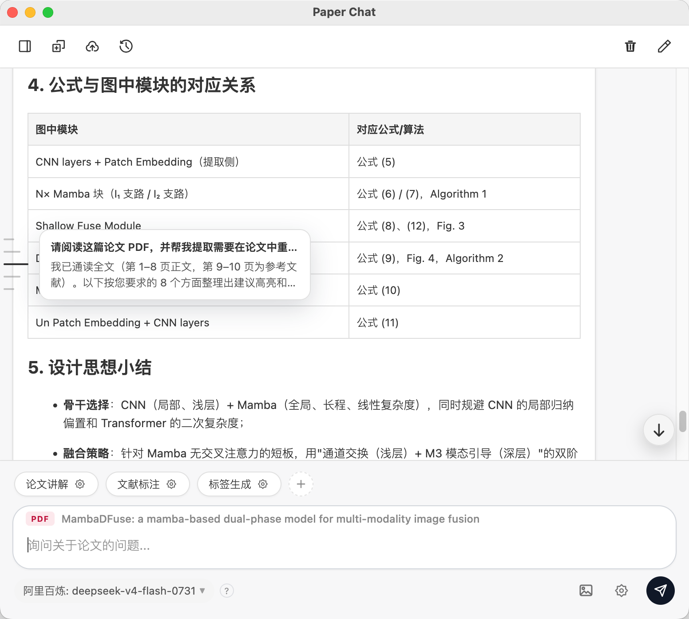
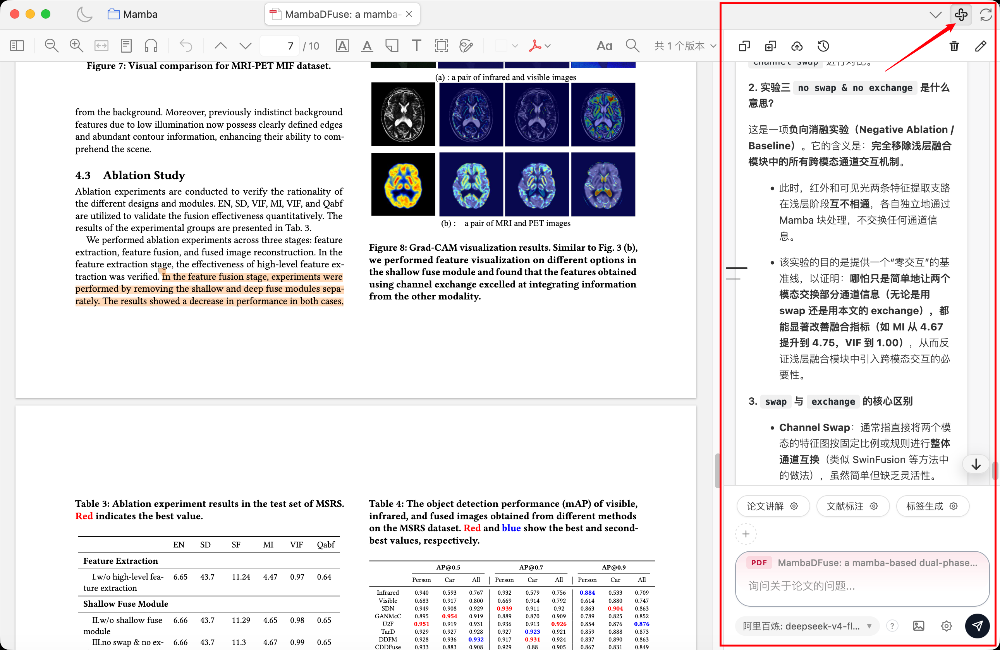
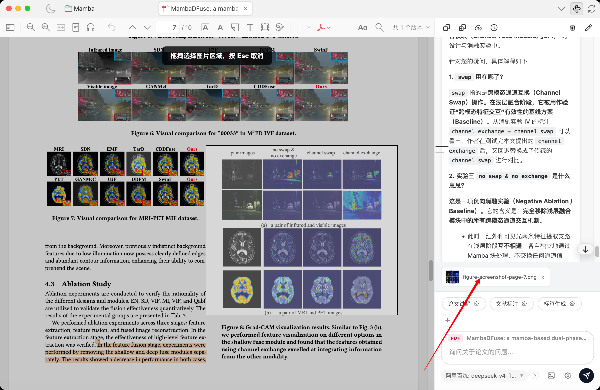
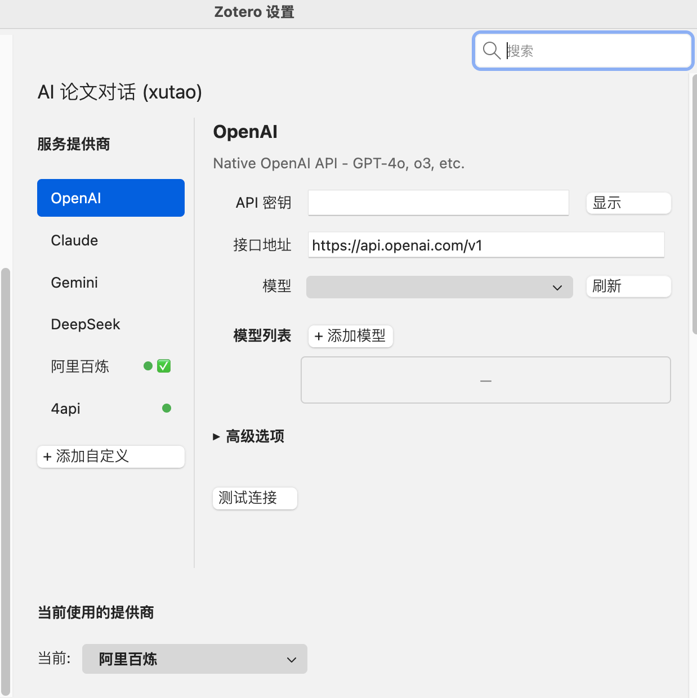
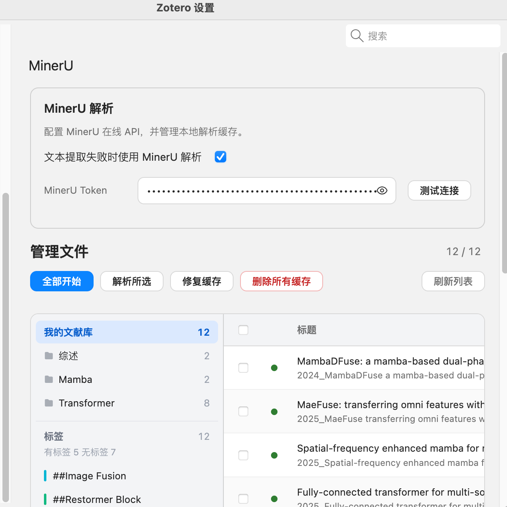

<h1> AI 论文对话 (xutao)</h1>

基于 [syt2/paper-chat-for-zotero](https://github.com/syt2/paper-chat-for-zotero) 的个人二创 fork。上游是完整的 Zotero AI 论文助手；本仓库只保留我日常读文献真正用到的部分，并做了少量改动。与上游插件 ID 不同，可与原版并存安装。

## 与上游的差异

**保留并使用：**

- 阅读器内对话：打开 PDF 后直接提问，支持附加全文上下文
- 截图提问：在阅读器中框选图表区域，截图自动带入对话
- 多服务商：OpenAI、Claude、Gemini、DeepSeek、阿里百炼等，自备 API Key
- 快捷操作：论文讲解、文献标注、标签生成等一键 prompt
- MinerU 解析：文本提取失败时自动/手动用 MinerU 解析 PDF
- 会话管理：多会话历史、轮次导航、删除单轮对话
- 流式输出、Markdown / 公式渲染、@ 引用条目/笔记

**本 fork 额外改动：**

- 输出截断时自动续写
- 笔记导出支持 LaTeX 公式（Zotero 原生数学节点）
- 设置页模型 API 测速
- 移除阅读循环等我用不上的功能

**未跟进上游的部分：** 演示文稿生成、内置 PaperChat 服务等——需要的话直接用上游原版。

## 截图

| 对话面板与快捷操作 | 阅读器分屏对话 |
| :---: | :---: |
|  |  |

| 截图提问 | 服务商配置 |
| :---: | :---: |
|  |  |

| MinerU 解析 |
| :---: |
|  |

## 安装

### 本地构建

```bash
npm install
npm run build
```

构建产物在 `build/` 目录。Zotero → 工具 → 附加组件 → ⚙️ → 从文件安装附加组件，选择 `.xpi` 文件。

### 开发调试

```bash
npm start
```

## 使用

1. 在 Zotero 中打开 PDF，点击工具栏聊天图标
2. 输入问题；需要全文上下文时勾选附加 PDF；框选图表可截图提问
3. 底部快捷按钮可一键触发常用 prompt（讲解、标注、打标签等）
4. 设置 → **AI 论文对话 (xutao)**：配置 API Key、选择模型、MinerU Token

## 许可证

[AGPL-3.0](LICENSE)（继承自上游项目）

## 致谢

- 原作者：[syt2/paper-chat-for-zotero](https://github.com/syt2/paper-chat-for-zotero)
- 插件模板：[zotero-plugin-template](https://github.com/windingwind/zotero-plugin-template)
